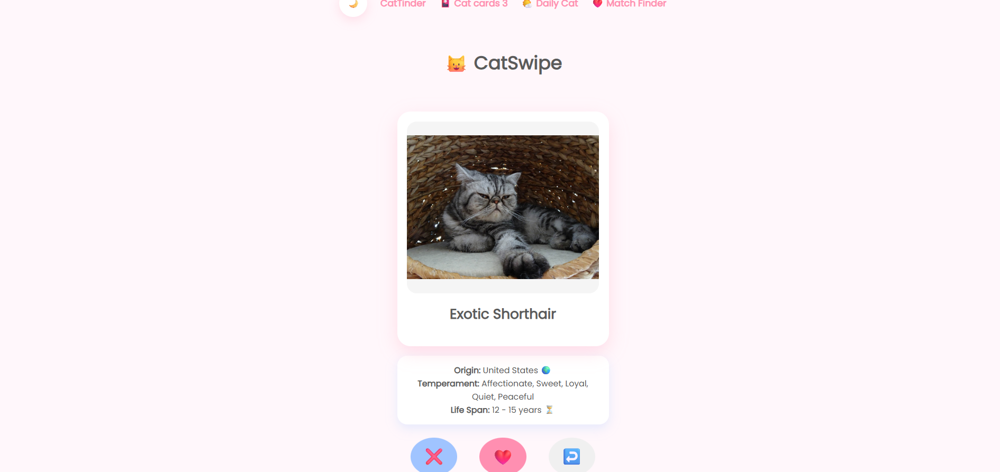
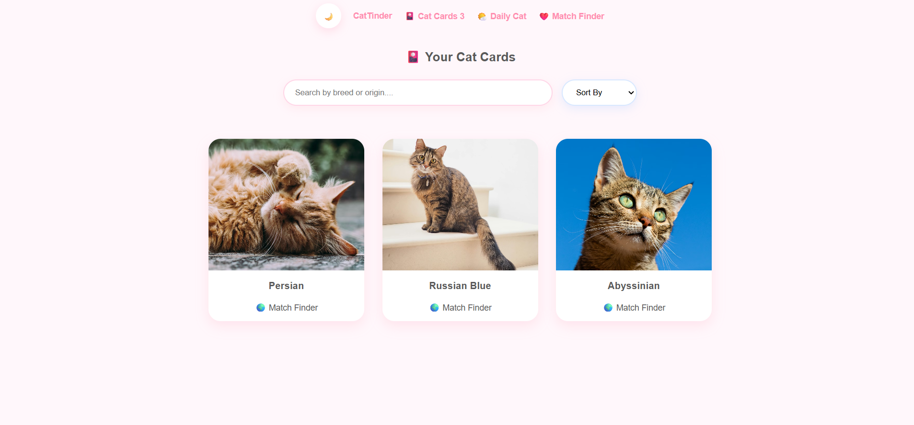
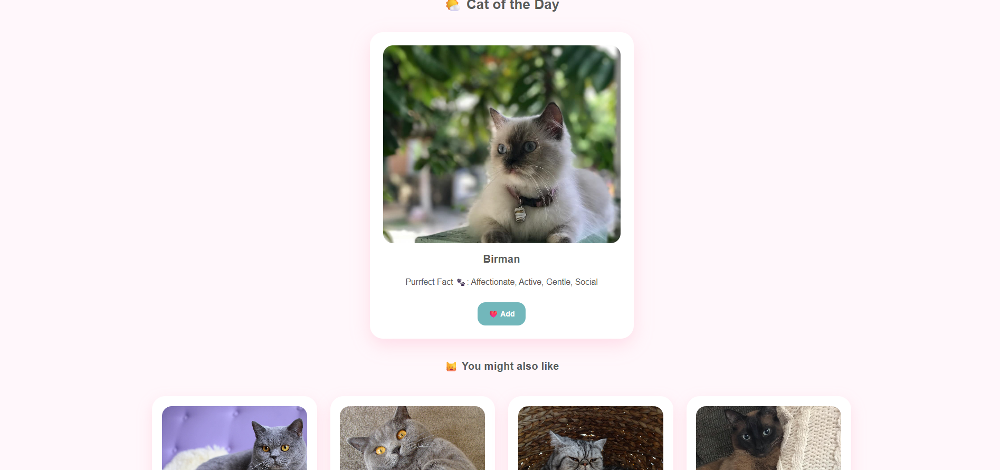
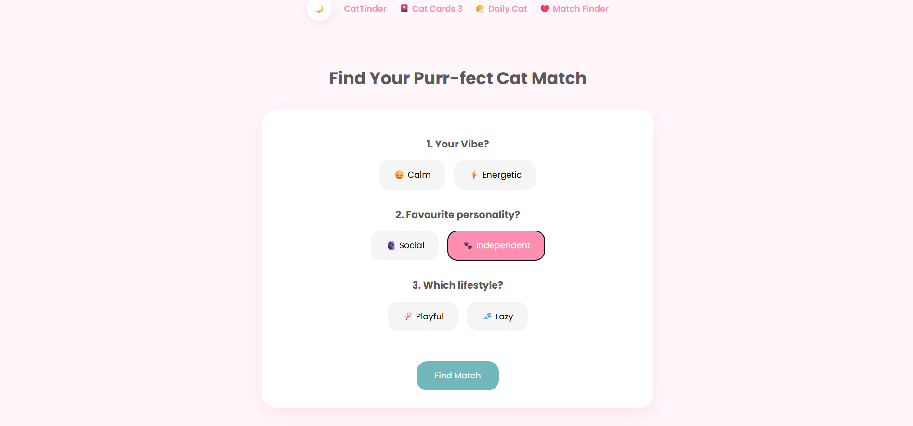

# CatSwipe

CatSwipe is a cat discovery web app inspired by swipe-style matching apps.
Users can explore random cat breeds, save favourites, discover a daily cat, and find their perfect cat match through a personality quiz.

Built using HTML, CSS, and JavaScript with data powered by TheCatAPI.

---

# Features

## Swipe Cats

- Swipe through random cat breeds
- Like or dislike cats
- Undo previous swipe
- Smooth swipe animations

## Cat Cards

- Saved favourite cats page
- Search cats by:
  - Breed
  - Origin
  - Temperament

- Sort by:
  - Name
  - Life span

- Remove saved cats
- Popup details modal

## Daily Cat

- Shows one special cat every day
- Daily cat is cached using localStorage
- Recommended cat section
- Add recommended cats directly to favourites

## Match Finder

A personality-based cat matching page.

Users can choose different personality styles such as:

- Calm
- Energetic
- Social
- Independent
- Playful
- Lazy

The app finds a matching cat breed with:

- Compatibility percentage
- Cat facts
- Save to favourites option

## Dark Mode

Custom dark theme inspired by a soft blue palette.

Works across:

- Home page
- Cards page
- Daily cat page
- Match Finder page

## Toast Notifications

Animated popup notifications appear in the bottom-right corner instead of browser alerts.

---

# UI Highlights

- Soft pastel design
- Responsive layout
- Animated buttons
- Hover effects
- Modal popups
- Smooth transitions
- Mobile-friendly cards

---

# Tech Stack

- HTML5
- CSS3
- JavaScript
- LocalStorage
- TheCatAPI

---

# Project Structure

```bash
CatSwipe/
│
├── index.html
├── cards.html
├── daily.html
├── match.html
│
├── css/
│   └── style.css
│
├── js/
│   ├── api.js
│   ├── swipe.js
│   ├── card.js
│   ├── daily.js
│   ├── match.js
│   └── theme.js
```

---

# How To Run

1. Download or clone the project
2. Open the folder in VS Code
3. Run using Live Server

Or simply open `index.html` in your browser.

---

# API Used

The project uses:

[https://thecatapi.com/](https://thecatapi.com/)

for:

- Cat images
- Breed details
- Temperament
- Origins

---

# Screenshots






```

# Author

Made by Avantika
```
